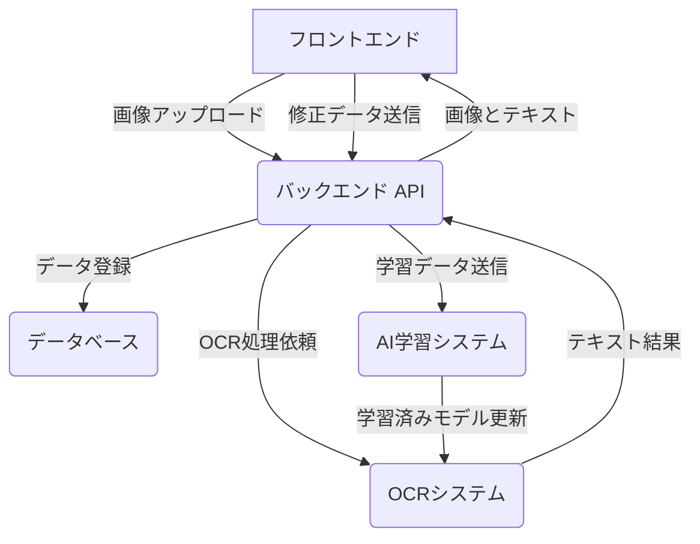

# photo_kakebo

レシートや領収書の写真をアップロードし、画像解析（OCR）によって家計簿を自動で登録・管理するシステムです。ユーザーによる修正データを活用し、継続的に解析精度を向上させることを目指します。

## 主な機能

-   レシート・領収書の画像アップロード機能
-   OCRによるテキストデータ抽出
-   抽出結果の確認・修正インターフェース
-   修正データに基づくAIモデルの再学習
-   家計簿データのデータベース登録
-   費目のカテゴリ、使用者、グループなどの管理機能
-   データ集計・可視化機能

## システム構成案



## ディレクトリ構成

-   `frontend/`: ユーザーが操作するWebアプリケーションのソースコード
-   `ocr-system/`: 画像からテキストを抽出するOCRシステムのバックエンド
-   `learning_ocr-ai/`: ユーザーの修正データをもとにAIモデルを再学習するシステム
-   `db-kakebo/`: 家計簿データを管理するAPIサーバーおよびデータベース関連
-   `docs/`: プロジェクトの設計書やAPI仕様書などのドキュメント

## セットアップ手順

1. **リポジトリをクローンします。**
   ```bash
   git clone https://github.com/imohiyoko/photo_kakebo.git
   cd photo_kakebo
   ```

2. **バックエンドの依存関係をインストールします。**
   ```bash
   cd db-kakebo
   npm install
   ```

3. **バックエンドサーバーを起動します。**
   ```bash
   npm start
   ```
   サーバーが `http://localhost:3000` で起動します。

4. **フロントエンドを確認します。**
   ブラウザで `frontend/index.html` を開きます。


## 今後のステップ

1.  **プロトタイピング**
    -   基本的な画像アップロードとOCR処理の実装
    -   OCR結果を表示・修正するシンプルなUIの作成
2.  **バックエンド開発**
    -   データベーススキーマの設計
    -   家計簿データを保存・管理するためのAPI実装
3.  **AI学習パイプラインの構築**
    -   修正データを収集し、定期的にモデルを再学習する仕組みの構築
4.  **機能拡充**
    -   カテゴリやグループ管理機能の実装
    -   月次レポートなどデータ可視化機能の実装